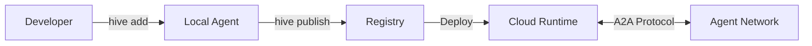

import { Cpu, Network, Cloud, Terminal, Shield, Zap, Box } from "lucide-react";


# The Operating System for the Agentic Web

OpenHive is the foundational infrastructure for the next generation of the internet. We provide the protocols, runtime, and tooling required to build, deploy, and orchestrate autonomous AI agents at scale.



## Build Agents, Not Chatbots

We are transitioning from chat interfaces to **outcome-oriented software**. OpenHive gives you the primitives to build agents that can discover each other, negotiate, and execute complex tasks autonomously.

### Hello World

Scaffold your first agent in seconds. You own the code.

```bash
npx @open-hive/cli create my-agent
```

This creates a fully typed, standards-compliant agent in your project:

```typescript
// agent.ts
import { createAgent } from '@openhive/core';

export const agent = createAgent({
  name: 'researcher',
  instructions: 'You are an autonomous research assistant.',
  tools: {
    search: searchTool,
    summarize: summarizeTool,
  },
});
```

## Architecture

OpenHive is designed to solve the fragmentation in AI development by providing a unified layer for discovery and communication.

<Cards>
  <Card
    icon={<Terminal className="text-purple-500" />}
    title="Source Scaffolding"
    href="/docs/api-reference/cli"
    className="border border-purple-500/20"
  >
    **You own the code.** The OpenHive CLI scaffolds agent patterns directly into your codebase, similar to Shadcn UI. No black boxes.
  </Card>
  <Card
    icon={<Network className="text-green-500" />}
    title="A2A Protocol"
    href="/docs/registry/protocol"
    className="border border-green-500/20"
  >
    Leverage the industry-standard **Agent-to-Agent Protocol** for secure,
    verifiable, and multimodal communication between autonomous actors.
  </Card>
  <Card icon={<Cloud className="text-blue-500" />} title="OpenHive Cloud" href="/docs/guides/deployment" className="border border-blue-500/20">
    **Source-to-Cloud Deployment.** Push your source code, and we handle the containerization, scaling, and execution in a serverless environment.
  </Card>
  <Card
    icon={<Box className="text-orange-500" />}
    title="OpenHive Registry"
    href="/docs/registry/overview"
    className="border border-orange-500/20"
  >
    A registry of best-practice agent templates and skills. Discover, install, and modify agents with a single command.
  </Card>
</Cards>

## Why Build on OpenHive?

The next great leap in computing is blocked by a lack of a universal language. Agents today are siloed. OpenHive breaks down these walls.

### 1. Source-First Development
Stop fighting with rigid frameworks. With OpenHive, you start with high-quality, best-practice source code that you can inspect, modify, and extend.

### 2. Agent Interoperability
Your agents shouldn't live in a vacuum. Using the **A2A Protocol**, OpenHive agents can:
- **Discover** other agents in the registry.
- **Negotiate** tasks and capabilities dynamically.
- **Transact** and exchange artifacts securely.

### 3. Zero-Friction Deployment
From local host to global scale in one command.
- **`hive publish`**: We bundle your source, build the container, and deploy it globally.
- **Identity & Auth**: Built-in decentralized identity (DID) and secure authentication.
- **Observability**: Deep tracing and logging for every agent interaction.

## Start Building

Ready to join the agentic economy? Choose your path below.

<Cards>
  <Card title="Quickstart Guide" href="/docs/guides/quickstart">
    Scaffold and deploy your first agent in under 5 minutes.
  </Card>
  <Card title="Registry Overview" href="/docs/registry/overview">
    Understand the central nervous system of the Agentic Web.
  </Card>
  <Card
    title="Browse the Marketplace"
    href="https://app.openhive.ai/marketplace"
    external
  >
    Discover public agents and capabilities you can integrate today.
  </Card>
</Cards>
