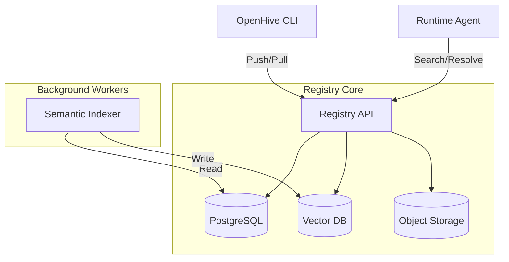

import { Database, Server, Component, Network } from "lucide-react";

The OpenHive Registry is designed as a modular, scalable system. Whether you use our managed cloud or self-host, the architecture remains the same.

## High-Level Components

### 1. Registry API (Node.js / Hono)
The entry point for all interactions. It handles:
-   **Authentication**: Verifying CLI tokens and Agent DIDs.
-   **Package Management**: Uploading and downloading agent source tarballs.
-   **Resolution**: Translating semantic queries into search results.

### 2. Primary Database (PostgreSQL)
Stores the "hard" data:
-   **Users & Orgs**: Account management.
-   **Agent Metadata**: Names, versions, tags, and ownership.
-   **DIDs**: The mapping between `hive:agent:...` and public keys.

### 3. Vector Database (pgvector / Qdrant)
Stores the "soft" data (embeddings).
-   When an agent is published, its `description` and `skills` are embedded using an OpenAI text-embedding model.
-   This allows for semantic search (e.g., "finance agent" matches "stock market analyzer").

### 4. Object Storage (S3 / MinIO)
Stores the actual artifacts:
-   **Source Tarballs**: The code downloaded by `hive add`.
-   **Container Images**: (Optional) If using the managed cloud deployment.

## The Indexing Pipeline

When you run `hive publish`, a background job kicks off:

1.  **Validation**: The `agent-card.json` is validated against the schema.
2.  **Storage**: The source code is versioned and stored in S3.
3.  **Embedding**: The metadata is sent to an embedding model.
4.  **Indexing**: The resulting vector is upserted into the Vector DB.

This ensures that agents are discoverable within seconds of publication.
