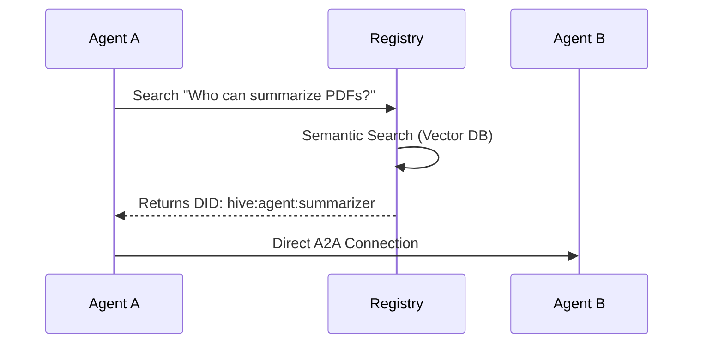

import { Database, Search, Globe, Lock, Box, Code } from "lucide-react";

The **OpenHive Registry** is the core infrastructure that enables the "Source-First" agentic web. It is not just a package manager; it is a dynamic resolution layer that connects intent to execution.

## What is the Registry?

At its heart, the Registry is a **federated index** of agent identities, capabilities, and source code.

1.  **Discovery**: Resolves semantic queries (e.g., "I need to analyze a PDF") to addressable agent endpoints (DIDs).
2.  **Distribution**: Hosts verified source code templates that developers can scaffold into their own projects.
3.  **Trust**: Manages the public key infrastructure (PKI) required for secure Agent-to-Agent (A2A) communication.

## Standards Compliance

OpenHive is designed for the federated agentic web. We fully support **W3C DCAT** and **JSON-LD** standards for agent metadata. This ensures that agents registered on OpenHive are discoverable and interoperable with any other compliant registry in the ecosystem.

## Core Functions

<Cards>
  <Card icon={<Box className="text-purple-500" />} title="Source Distribution">
    The registry acts as a repository for agent source code. When you run `hive add`, you are downloading a verified template directly into your codebase.
  </Card>
  <Card icon={<Globe className="text-blue-500" />} title="Unified Discovery">
    A single search endpoint that resolves **Public Agents** and **Private Agents** you are entitled to access. No separate silos.
  </Card>
  <Card icon={<Search className="text-orange-500" />} title="Semantic Search">
    Powered by vector embeddings, the registry supports natural language
    queries. You don't need to know an agent's exact name—just describe what you
    need.
  </Card>
  <Card icon={<Lock className="text-red-500" />} title="Entitlements & Access">
    Granular access control is built-in. Organizations can publish private agents that are only discoverable by authorized members or entitled partners.
  </Card>
</Cards>

## The "Source-First" Philosophy

Unlike traditional SaaS platforms where you rent a black box, OpenHive is built on **ownership**.

When you interact with the registry via the CLI:

```bash
npx @open-hive/cli create financial-analyst
```

You are not just calling an API; you are **forking** a proven architectural pattern into your own repository. This gives you:
-   **Full Control**: Modify the prompt engineering, swap the LLM, or change the logic.
-   **No Lock-in**: The agent runs on your infrastructure (or ours), but the code is yours.

## Runtime Resolution

The Registry is also a critical runtime component. Agents query it to find peers.



This decoupling allows agents to be loosely coupled. Agent A doesn't need to know Agent B's URL hardcoded; it just needs to know the *intent*.
