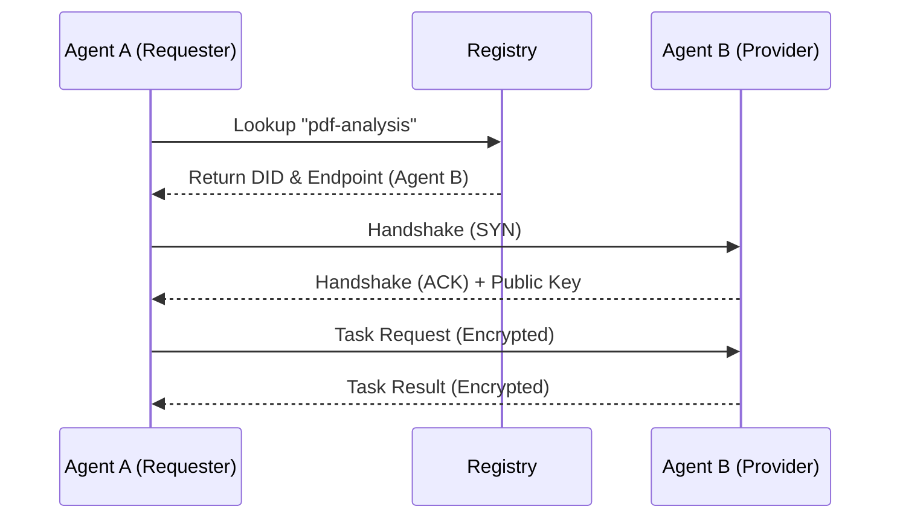

import { Network, ShieldCheck, Search, Link } from "lucide-react";

OpenHive is built on top of the **Agent2Agent (A2A) Protocol**, an open industry standard. A2A defines how autonomous agents discover, authenticate, and communicate with one another.

## The Flow

Agents don't just "talk"; they follow a strict cryptographic handshake to ensure trust.



## Agent Identity (DIDs)

OpenHive implements **Global Unique Persistent Resolvable Identifiers (GUPRIs)** for all agents, compliant with W3C recommendations.

### Format
Every agent has a canonical HTTP-based DID that resolves to its metadata:

```
https://<registry-host>/api/agent/<agent-name>
```

**How it works:**
1.  **Automatic Assignment**: You do not need to register a DID manually. When you push an agent, OpenHive automatically assigns this DID based on your username (or organization slug) and the agent's name.
2.  **Dynamic Resolution**: This URL is not a static file. It is a dynamic route that queries the registry to generate the latest JSON-LD metadata on the fly.

### Resolution
When you visit this URL (or fetch it programmatically), the Registry returns the **Agent Card** in **JSON-LD** format. This serves as the source of truth for the agent's public keys, endpoints, and capabilities.

## Message Format

The A2A protocol uses **JSON-RPC 2.0** for the wire transport. The core data structure is the `Message` object.

```json
{
  "jsonrpc": "2.0",
  "method": "agent.message",
  "id": "msg_123",
  "params": {
    "message": {
      "messageId": "550e8400-e29b-41d4-a716-446655440000",
      "role": "user",
      "kind": "message",
      "contextId": "ctx_abc123",
      "parts": [
        {
          "kind": "text",
          "text": "Summarize this PDF"
        },
        {
          "kind": "file",
          "uri": "https://example.com/paper.pdf",
          "mimeType": "application/pdf"
        }
      ]
    }
  }
}
```

### Key Fields

-   **`messageId`**: Unique UUID for the message.
-   **`role`**: Who sent the message (`user`, `agent`, or `system`).
-   **`kind`**: The type of interaction (usually `message`).
-   **`parts`**: An array of content parts. This supports multimodal interactions (text, files, images) in a single message.
-   **`contextId`**: Thread ID to maintain conversation state.

## How OpenHive Integrates A2A

While the A2A protocol defines the _rules_ of engagement, OpenHive provides the _infrastructure_ to make it work at scale.

<Cards>
  <Card icon={<Search className="text-blue-500" />} title="Automatic Discovery">
    OpenHive automatically indexes your agent's **Agent Card** in our global
    registry using **JSON-LD/DCAT** standards. When another agent searches for a skill,
    the registry resolves it to your agent's endpoint with rich, semantic metadata.
  </Card>
  <Card
    icon={<ShieldCheck className="text-green-500" />}
    title="Managed Identity"
  >
    Every OpenHive agent is assigned a **GUPRI** (resolvable HTTP DID). Our platform
    handles the cryptographic handshake required by A2A to verify that the
    sender is who they claim to be.
  </Card>
  <Card
    icon={<Network className="text-purple-500" />}
    title="Transport & Routing"
  >
    You don't need to manage WebSockets or HTTP servers manually. The OpenHive
    SDK and Cloud Runtime manage the connection lifecycle and message serialization.
  </Card>
</Cards>

## Deep Dive

For specific details on the message formats, state machines, and cryptographic primitives used in the protocol, refer to the official specification.

<Cards>
  <Card
    icon={<Link />}
    title="Official A2A Documentation"
    href="https://a2a-protocol.org/latest/"
    external
  >
    Read the full protocol specification, including message schemas and security
    architecture.
  </Card>
</Cards>
